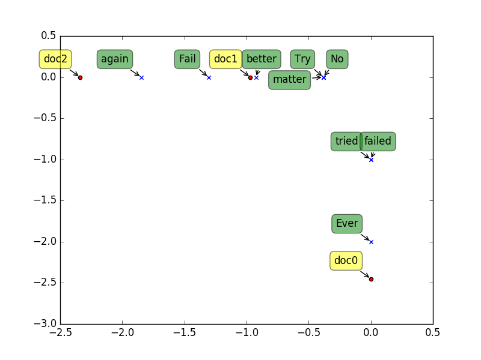

## Sample 

### 1 文本

doc0 = 'Ever tried. Ever failed'

doc1 = 'No matter. Try again.'

doc2 = 'Fail again. Fail better.'

#### 1.1 词－文档矩阵

根据从行还是列的角度来看,可以得到不同的向量 

从行来看,可以得到每个词项对应的文档向量

从列来看,可以得到每个文档对应的词项向量

|        | doc0 | doc1 | doc2 |
| :----- | ---- | ---- | ---- |
| Ever   | 2    | 0    | 0    |
| tried  | 1    | 0    | 0    |
| failed | 1    | 0    | 0    |
| No     | 0    | 1    | 0    |
| matter | 0    | 1    | 0    |
| Try    | 0    | 1    | 0    |
| Fail   | 0    | 1    | 1    |
| again  | 0    | 0    | 2    |
| better | 0    | 0    | 1    |

#### 1.2 降维(SVD)

$\begin{matrix} 2&0&0\\1&0&0\\1&0&0\\0&1&0\\0&1&0\\0&1&0\\0&1&1\\0&0&2\\0&0&1 \end{matrix}$   =  $\begin{matrix} 0.00&-0.82&0.00\\0.00&-0.41&0.00\\0.00&-0.41&0.00\\0.15&0.00&0.49\\0.15 &0.00&0.49\\0.15&0.00&0.49\\0.52&0.00&0.29\\0.73&0.00&-0.40\\0.36&0.00&0.20\end{matrix}$$*$$\begin{matrix}2.53&0&0\\0&2.45&0\\0&0&1.89\end{matrix}$$*$$\begin{matrix}0.00&-0.38&-0.92\\-1.00&0.00 &0.00\\-0.00&0.92&-0.38\end{matrix}$

转换后的每一维代表一个潜在概念。（如上矩阵，共有三个潜在概念）

第一个矩阵：每一行代表一个词，每一列表示一个潜在概念，这一行的每个非零元素表示这个词在这个概念中的重要性。如第一个词（Ever）与第二个概念比较相关（－0.82）

第三个矩阵：每一列对应一篇文本，每一行对应一个潜在概念，这一列的每个元素表示这篇文本在不同概念中的相关性。如第一篇文本明显属于第二个概念（－1.00）

因此只要对词－文档矩阵进行一次奇异值分解，就可以同时完成近义词的分类和词的分类

##### 1.2.1 原文档向量和词向量：

**doc0 = (2 1 1 0 0 0 0 0 0)^T^   doc1 = (0 0 0 1 1 1 1 0 0)^T^   doc2 = (0 0 0 0 0 0 1 2 1)^T^**

**Ever = (2 0 0)^T^   tried = (1 0 0)^T^   failed = (1 0 0)^T^   No = (0 1 0)^T^   matter = (0 1 0)^T^**

**Try = (0 1 0)^T^   Fail = (0 1 1)^T^   again = (0 0 2)^T^   better = (0 0 1)^T^**

##### 1.2.2 降维（3维-2维）

取2维德潜在概念
$$
令U = \begin{matrix}0.00&0.82\\0.00&-0.41\\0.00&-0.41\\0.15&0.00\\0.15&0.00\\0.15&0.00\\0.52&0.00\\0.73&0.00\\0.36&0.00\end{matrix}         令 s ＝\begin{matrix}2.53&0\\0&2.45\end{matrix}        令 V＝ \begin{matrix}0.00&-0.38&-0.92\\-1.00&0.00&0.00\end{matrix}
$$

##### 1.2.3 新文档向量和词向量

$$
\overrightarrow{newdoc} = U^T * \overrightarrow{doc}
$$

$$
\overrightarrow{newword} =  V * \overrightarrow{word}
$$

##### 1.2.4 计算后结果(LSA)

**doc0 = (0.00 -2.45)^T^  doc1 = (-0.97 0.00)^T^ doc2 = (-2.34 0.00)^T^**

**Ever = (0.00 -2.00)^T^   tried = (0.00 -1.00)^T^   failed = (0.00 -1.00)^T^   No = (-0.38 0.00)^T^   matter = (-0.38 0.00)^T^**

**Try = (-0.38 0.00)^T^   Fail = (-1.31 0.00)^T^   again = (-1.85 0.00)^T^   better = (-0.92 0.00)^T^**

这样可以通过新的词向量及文档向量对词或者文档进行分析，如聚类，相似度分析等等。

